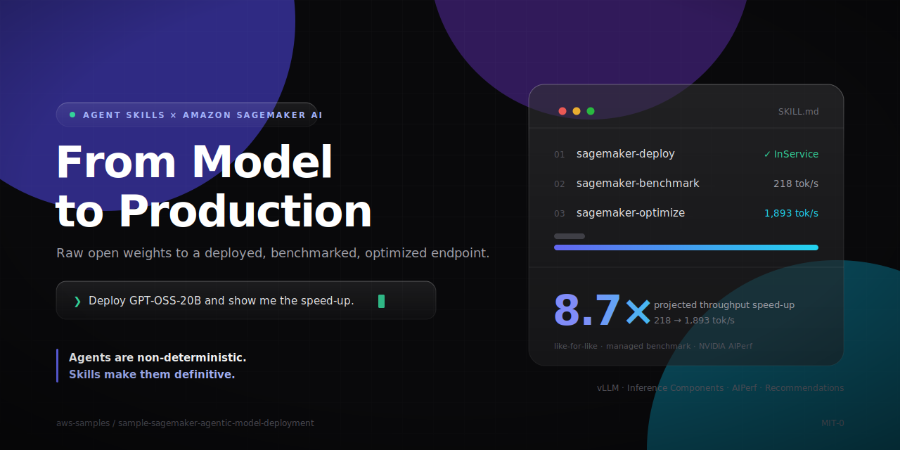
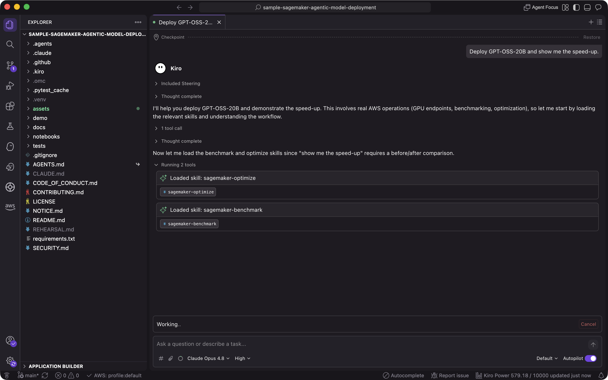

# From Model to Production: Agentic AI on Amazon SageMaker



> Take a raw open-weight model to a deployed, **benchmarked, and optimized**
> Amazon SageMaker AI endpoint through a coding agent, **without writing the
> plumbing by hand**.

Stop wrestling with model staging, instance selection, deployment
configuration, and benchmarking loops. In this repository, Kiro, Claude Code,
Codex, or another compatible coding agent takes an open-weight model from its
public checkpoint to a SageMaker endpoint, benchmarks it, finds a better
serving configuration, and shows the **before/after**. Portable `SKILL.md`
contracts steer the workflow.

The running example is **GPT-OSS-20B**. The skills and scripts are
model-agnostic: the agent researches each requested checkpoint and passes its
decisions as explicit arguments instead of adding another model profile to the
code.

## The whole point, in one picture

[`notebooks/demo.ipynb`](notebooks/demo.ipynb) does the workflow **by hand**:
every `boto3` call, parameter, and polling loop is inline. It is deliberately
long and fiddly because that is what the workflow actually takes. The agent
does the same work from a one-line prompt because `SKILL.md` already captures
the operational knowledge.

| | By hand (`notebooks/demo.ipynb`) | With the agent (`.kiro/skills`) |
|---|---|---|
| Deploy | About 10 cells: resolve the DLC, build the environment, make 4 API calls, and run 2 polling loops | *"Deploy GPT-OSS-20B for benchmarking."* |
| Benchmark | Build the workload, launch and poll the job, then download, extract, and parse the S3 result bundle | *"Benchmark this endpoint."* |
| Optimize | Run a recommendation job, inspect the configuration, redeploy, and benchmark again | *"Find a faster serving configuration and show the speed-up."* |

The notebook is not the easy path. It is the "here is everything the skill is
doing for you" path. The point is the contrast.

## Run it with prompts

Open this repository in a SageMaker Studio space or another environment with
AWS credentials. The workflow becomes a handful of natural-language prompts:



> **"Deploy GPT-OSS-20B to a SageMaker endpoint for benchmarking."**

`sagemaker-deploy` resolves the model revision, stages the weights directly to
S3 when needed, selects a compatible vLLM DLC and GPU topology, calls
`CreateModel` -> `CreateEndpointConfig` -> `CreateEndpoint` ->
`CreateInferenceComponent`, and smoke tests the endpoint.

> **"Benchmark this endpoint."**

`sagemaker-benchmark` creates the managed workload and benchmark jobs, polls
them to completion, downloads the AIPerf result bundle from S3, and reports
TTFT, ITL, latency, throughput, and invalid requests. This is the baseline.

> **"Find a faster serving configuration and show me the speed-up."**

`sagemaker-optimize` runs a SageMaker AI inference recommendation job, reads
the winning configuration, redeploys it, and benchmarks the same workload
again for a like-for-like before/after comparison.

Deep model optimization, including quantization or speculative decoding, can
take much longer and require scarce GPU capacity. Run that path asynchronously
and keep the result for review.

When finished, ask the agent to delete all endpoint compute and confirm that no
endpoint remains.

## The idea: skills are the portable contract

A coding agent on its own is **non-deterministic**. Ask it to deploy a model
twice and it can choose a different image, API sequence, or topology. A skill
defines the evidence, AWS APIs, safety checks, and cleanup that must remain
consistent.

> **Agents are non-deterministic. Skills make them definitive.**

A skill is a senior engineer's operational knowledge captured once as a
contract. The agent still researches the model and chooses the checkpoint,
engine, hardware, parallelism, context limit, and request fields. The skill
makes those choices explicit and reviewable before resources are created.

The skills follow the open [Agent Skills](https://docs.kiro.dev) format and are
self-contained according to the
[Agent Skills specification](https://agentskills.io). Each `SKILL.md` travels
with the scripts, datasets, and sample output it needs. The IDE is
interchangeable; the contract is the asset.

## The three skills

1. **`sagemaker-deploy`**
   - Resolve an immutable Hugging Face revision and stream it directly to S3
     with SageMaker Processing.
   - Choose vLLM or SGLang, a GPU topology, and a standard or Inference
     Component endpoint.
   - Validate the plan, deploy, and run an OpenAI-compatible smoke request.

2. **`sagemaker-benchmark`**
   - Run SageMaker AI managed inference benchmarking with NVIDIA AIPerf.
   - Report TTFT, ITL, request latency, requests per second, and token
     throughput.
   - Download and explain the full result bundle instead of returning only a
     job ID.

3. **`sagemaker-optimize`**
   - Search for a better serving configuration or run deeper model
     optimization.
   - Read the recommended instance, model copies, environment, and expected
     performance.
   - Deploy the recommendation so the same workload can be benchmarked again.

All billable operations are opt-in. The scripts print a dry-run plan before
`--run`, `--deploy`, or `--yes` creates or deletes resources.

## Portable across coding agents

`.kiro/skills` is the canonical copy. Kiro reads `.kiro/skills`, Claude Code
reads `.claude/skills`, and other compatible agents read `.agents/skills`.
These paths point to the same contracts:

```text
.
|-- .kiro/
|   |-- skills/
|   |   |-- sagemaker-deploy/
|   |   |-- sagemaker-benchmark/
|   |   `-- sagemaker-optimize/
|   `-- steering/project.md
|-- .agents/skills -> ../.kiro/skills
|-- .claude/skills -> ../.kiro/skills
|-- .claude/CLAUDE.md -> ../.kiro/steering/project.md
|-- AGENTS.md -> .kiro/steering/project.md
`-- notebooks/demo.ipynb
```

The steering file follows the [agents.md convention](https://agents.md), so an
improvement made for one compatible agent is immediately available to the
others.

## Model-agnostic by design

The deployer contains no built-in GPT-OSS, GLM, Kimi, Llama, Qwen, or Gemma
profile. For each request, the agent checks current model cards and AWS
documentation, then supplies the immutable revision, serving engine, image,
instance, tensor parallelism, context and concurrency limits, engine
environment, and request shape.

The Python scripts remain generic SageMaker and S3 execution primitives. A new
model normally changes the agent's arguments, not the implementation. If a
checkpoint cannot fit a single endpoint, the agent should select an official
quantization or an appropriate SageMaker multi-node architecture instead of
adding a one-model branch to `deploy.py`.

## Measured example: GPT-OSS-20B

The repository includes sanitized artifacts from real SageMaker jobs:

- `.kiro/skills/sagemaker-benchmark/sample-output/` contains the complete
  AIPerf baseline bundle.
- `.kiro/skills/sagemaker-optimize/sample-output/recommendation.json` contains
  a completed configuration-search result.

The baseline used ShareGPT-style traffic with about 500 input tokens, 256
output tokens, concurrency 10, and 300 requests.

| Metric | Baseline benchmark (measured) | Recommendation (`ExpectedPerformance`) |
|---|---:|---:|
| Serving configuration | `ml.g6.16xlarge`, 1 model copy | `ml.g6.24xlarge`, 2 copies, TP=2 |
| Output-token throughput | 218.10 tokens/s | 1,893.21 tokens/s |
| TTFT p50 | 270.79 ms | 269.55 ms |
| ITL p50 | 43.42 ms | 43.38 ms |
| Request latency p50 | 6,425.03 ms | 11,134.94 ms |

The recommendation projects about **8.7x** the baseline throughput by using
more GPU compute and much higher concurrency. It is not a free model-level
speedup. Deploy and benchmark it with the same workload before making a
production claim.

The historical baseline recorded 290 valid requests. Ten reasoning-model
responses returned HTTP 200 with reasoning text but `content: null`, which
crossed AIPerf's validity threshold. The bundled metrics and failure record
preserve that result rather than hiding it.

## Prerequisites

- Python 3.10 or later.
- AWS credentials and a SageMaker execution role with access to SageMaker AI,
  S3, ECR, CloudWatch, and the required discovery APIs.
- Endpoint quota and regional capacity for the selected GPU instance.
- A capacity reservation for time-sensitive deployments on scarce instances.

Quota is not a capacity guarantee.

## Cost and cleanup

This sample can create persistent S3 objects, a short-lived CPU Processing job,
continuously billed GPU endpoints, and managed benchmark or recommendation
compute. Delete endpoint compute as soon as validation finishes. Staged S3
weights remain for reuse and must be removed separately when no longer needed.

## Security and production use

Review [SECURITY.md](SECURITY.md) before production use. Apply least-privilege
IAM, encryption, network controls, immutable model and image revisions, model
governance, prompt and output handling, and use-case-specific safety
evaluation.

This software does not make a checkpoint safe, accurate, licensed for your use,
or production-ready by itself. Those remain the deployment owner's
responsibilities.

## License

This sample is licensed under the MIT No Attribution license. See
[LICENSE](LICENSE). Model weights remain subject to their publishers' licenses
and acceptable-use terms.

Contributions are welcome; see [CONTRIBUTING.md](CONTRIBUTING.md).
